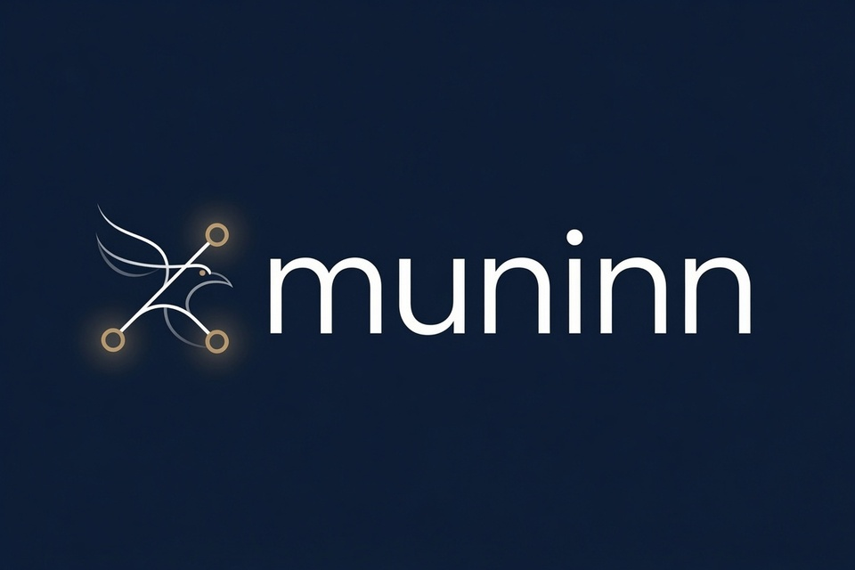

<p align="center">
  
</p>

# muninn

*Named for Muninn, Odin’s raven of memory.*

[](https://github.com/scottlarkin/muninn-release/releases/latest)

Persistent memory for coding agents. muninn records what you and your agent
work on, distils durable lessons from it, and injects the relevant parts back
into every prompt automatically — so you stop re-explaining your codebase,
your conventions, and the approaches that already failed.

It runs entirely on your own machine. Your memory graph lives in a database you
control, prompts go only to model endpoints you configure, and nothing is
reported anywhere.

**Three ways to use it:**

- **With Claude Code** — hooks record and inject automatically, nothing to run.
  This is the reference integration.
- **As a plain CLI** — `muninn search`, `recall`, `remember`, `similar`,
  `impact`, `risky`, `open`. No agent required; useful on its own.
- **With another agent** — the integration points are ordinary subcommands that
  read one JSON object on stdin and may write one to stdout, so any harness with
  lifecycle hooks can drive it. See `muninn hook --help`.

Closed-source software. See [LICENSE](LICENSE).

## What it does

- **Auto-injected recall.** A `UserPromptSubmit` hook finds the memory relevant
  to what you just asked and prepends it. No command to remember to run.
- **Lessons with confidence.** Corrections and preferences become durable
  lessons, deduplicated semantically and superseded in chains as you change your
  mind. Lessons that keep proving useful gain confidence; ones that keep failing
  lose it (see [How it works](#how-it-works)).
- **Dead ends.** Negative knowledge is first class: "X was tried for P and did
  not work because Y". Surfaced in its own section so an agent stops re-exploring
  approaches you already ruled out.
- **A code graph.** tree-sitter parses TypeScript/JavaScript, Python, Go, and
  Elixir into files, functions, classes and types with import and call edges, so
  you can ask what depends on a symbol, which files are risky to change, and
  where similar code already exists.
- **Entity ontology.** People, tools, projects and concepts are minted as typed
  entities and linked, so recall can follow relationships rather than just
  matching text.

Not a vector dump of past chats. Lessons are scored by outcomes, dead ends are
first-class, and the code graph sits beside session memory so recall can follow
structure as well as text.

## How it works

Memory improves from **outcomes**, not just from being recalled.

1. **Record.** Prompts and responses land in your graph. Durable lessons and
   dead ends are distilled from sessions; you can also assert facts with
   `muninn remember` or record a failed approach with `muninn remember --dead-end`.
2. **Recall.** On the next prompt, muninn ranks related past work, lessons,
   dead ends, entities, and code, then injects what is relevant.
3. **Reinforce.** A clean turn raises confidence on lessons that were recalled
   and kept; ones with usage evidence rise faster. A correction lowers it.
   Lessons that keep failing fall past the recall cutoff and stop surfacing.
   Explicit `remember` assertions stick until you change or forget them.
4. **Structure.** A code graph (imports, calls, symbols) and an entity layer
   that grows as you work (people, tools, projects, concepts) let recall follow
   relationships, not only similar text.

The loop is automatic under Claude Code hooks. The CLI exposes the same graph
when you want to search, recall, or inspect by hand.

## Who it's for

- Claude Code or CLI users who re-explain conventions and architecture every
  session, or watch the agent re-try approaches that already failed.
- Anyone who wants code-aware tools (`similar`, `impact`, `risky`) on top of
  memory, with the graph under their control.

Not a fit if you only want chat history, need Windows, or want zero-ops cloud
memory with no local graph. Project instruction files still matter; muninn
complements them rather than replacing them.

## See it work

CLI demos below. With Claude Code, the same memory is injected into prompts
automatically — no command to remember.

**`muninn recall`** — what you worked on, reconstructed from the graph:

https://github.com/user-attachments/assets/3b236420-2010-40c2-a0c9-50ac55925c22

**`muninn open`** — describe the code you want and it opens the files:

https://github.com/user-attachments/assets/545e24c7-45be-43cb-9e1e-c5eedad3c8bd

## Quick start

```sh
curl -fsSL https://raw.githubusercontent.com/scottlarkin/muninn-release/main/install.sh | bash
```

The installer detects your platform, verifies the download against its
checksum, and asks how you want each dependency:

| | Options |
|---|---|
| **Memory graph** (neo4j) | run it in Docker · use one you already run · a remote/Aura instance |
| **Embeddings** | Ollama in Docker · an Ollama you already run (it asks the port) · a remote OpenAI-compatible endpoint |
| **LLM** (distils lessons) | Anthropic · a local Ollama model · a remote OpenAI-compatible endpoint · skip |

It only starts the containers you actually need, writes the matching config,
initialises the graph schema, and can wire Claude Code hooks — each step only
after you confirm. Flags: `--no-stack`, `--no-claude`, `--prefix`, `--yes`
(`install.sh --help`).

When it finishes:

```sh
muninn doctor                  # every line should read ok
cd ~/your/project
muninn index                   # build the code graph for this repo
```

Restart Claude Code if you installed hooks so they load.

Using an agent to install? Point it at
[for-agents.md](https://github.com/scottlarkin/muninn-release/blob/main/for-agents.md).

<details>
<summary><b>Manual install</b> — tarball instead of the installer script</summary>

Pick your platform — `darwin_arm64` (Apple Silicon), `darwin_amd64` (Intel Mac),
`linux_amd64`, or `linux_arm64`. Set `VERSION` to the tag on the
[latest release](https://github.com/scottlarkin/muninn-release/releases/latest)
(or resolve it with the one-liner below):

```sh
VERSION=$(curl -fsSL https://api.github.com/repos/scottlarkin/muninn-release/releases/latest | sed -n 's/.*"tag_name": *"\([^"]*\)".*/\1/p' | head -1)
PLATFORM=darwin_arm64   # or linux_amd64, etc.

curl -fsSL -o muninn.tar.gz \
  "https://github.com/scottlarkin/muninn-release/releases/download/${VERSION}/muninn_${VERSION}_${PLATFORM}.tar.gz"
tar -xzf muninn.tar.gz
sudo mv muninn /usr/local/bin/
muninn version
```

Verify against `checksums.txt` on that
[release](https://github.com/scottlarkin/muninn-release/releases/latest):

```sh
shasum -a 256 muninn.tar.gz
```

Then run the **Manual set up** steps below (the tarball is only the binary).

> **macOS: use `curl`, not your browser.** Gatekeeper quarantines files
> downloaded through a browser, and the binary will refuse to run —
> `curl` is not affected. If you did download it through a browser:
>
> ```sh
> xattr -dr com.apple.quarantine /usr/local/bin/muninn
> ```
>
> The binary is signed ad-hoc but not notarised.

</details>

<details>
<summary><b>Manual set up</b> — without the installer (or after a tarball install)</summary>

**1. Start the dependencies.**

```sh
muninn stack init
docker compose -f ~/.config/muninn/stack/docker-compose.yml up -d
```

`stack init` writes a compose file for neo4j and Ollama, generates a neo4j
password, and prints the config to match. Both services bind to loopback only.
The first start pulls the embedding models, which takes a few minutes.

**2. Write a config file.**

```sh
muninn config init
```

Then set the neo4j password `stack init` printed:

```toml
[neo4j]
password = "…"
```

Everything else is optional — every setting has a default, and every line in the
generated file is commented out with its default shown.

**3. Create the graph schema.**

```sh
muninn schema init
```

**4. Wire up Claude Code** — optional; skip it if you only want the CLI.

```sh
muninn install
```

This shows you every file it will write and every hook it will add, then waits
for your confirmation before touching `~/.claude`. Use `--dry-run` to preview
without being asked, or `--yes` in a script. `muninn install --uninstall`
reverses it. An existing `settings.json` is merged, not replaced, after a
timestamped backup.

Restart Claude Code afterwards so the hooks load.

**5. Check it.**

```sh
muninn doctor
```

Every line should read `ok`. Then index a repository:

```sh
cd ~/your/project
muninn index
```

</details>

## Requirements

Always: **macOS 12+** (Apple Silicon or Intel) or **Linux with glibc 2.34+**
(Debian 12+, Ubuntu 22.04+, RHEL 9+).

Everything else depends on how much you run yourself. muninn needs three things —
a graph, an embedder, and an LLM — and each can be local or remote, so the
footprint ranges from "a 15 MB binary" to "a small workstation".

| | Fully remote | Local graph, remote models | Fully local |
|---|---|---|---|
| **Graph** | your neo4j / Aura | Docker neo4j | Docker neo4j |
| **Embeddings** | remote API | remote API | Ollama |
| **LLM** | remote API | remote API | Ollama |
| **Docker** | not needed | yes | yes |
| **Disk** | ~15 MB | ~1 GB | ~15 GB |
| **RAM** | negligible | ~2 GB | 16 GB comfortable |
| **Cost** | per-token + hosting | per-token | free |
| **Privacy** | data leaves your machine | prompts leave your machine | nothing leaves |

Where the disk goes: the binary is 15 MB. The neo4j image is ~1 GB. The Ollama
image is ~9 GB on its own — it bundles GPU runtimes — plus ~0.6 GB of embedding
models and ~4.7 GB for the default local LLM (`qwen2.5-coder:7b`).

RAM: neo4j is configured for a 1 GB heap. A 7B local model needs roughly 5 GB
more while it runs, which is what pushes the fully-local column up.

> **On macOS, prefer a native Ollama** over the Docker one — the
> [app or `brew install ollama`](https://ollama.com/download) is a fraction of
> the size and gets GPU acceleration, which the containerised version does not.
> The installer will detect it: choose "I already have Ollama running".

Mixing is normal — a local graph with a hosted LLM is a good default, since the
graph holds your memory and the LLM only sees individual prompts.

## Using it

With Claude Code, recall is automatic — the hooks handle it, and the skills give
you slash commands. **Every one of these also works as a plain CLI command**, with
or without an agent installed.

| Skill | Command | What it does |
|---|---|---|
| `/muninn-recall` | `muninn recall --window 7d` | What you worked on over a time window, or a file's history |
| `/muninn-search` | `muninn search "<query>"` | Search memory with your own phrasing |
| `/muninn-remember` | `muninn remember "<fact>"` | Save a fact, preference or decision durably |
| `/muninn-dead-end` | `muninn remember --dead-end "<what failed>"` | Record an approach that did not work |
| `/muninn-forget` | `muninn forget "<phrase>"` | Delete memories, with a preview and confirmation |
| `/muninn-find-similar` | `muninn similar "<description>"` | Find existing code before writing new code |
| `/muninn-impact` | `muninn impact <symbol\|file>` | What breaks if you change this |
| `/muninn-risky` | `muninn risky` | Files that are both central and historically buggy |
| `/muninn-open` | `muninn open "<description>"` | Open the files matching a description |
| `/muninn-index` | `muninn index` | Build or refresh the code graph |
| `/muninn-entities` | `muninn entities` | Browse the entity vocabulary |
| `/muninn-view` | `muninn view` | The memory graph for this session |
| `/muninn-recall-test` | `muninn search "<prompt>"` | Preview exactly what recall would inject |

`muninn --help` lists everything.

### Upgrading

```sh
muninn upgrade           # or --check to see if there is a newer release
```

It replaces the running binary in place, so an install under a different path or
name updates itself and the Claude Code hooks keep pointing at it. The download is
checksum-verified and a mismatch aborts without touching what you have.

Skills are embedded in the binary, so run `muninn install` afterwards to refresh
the copies in `~/.claude`, then restart Claude Code.

## Configuration

Config lives at `~/.config/muninn/config.toml`. Precedence, lowest first:

```
defaults  <  config.toml  <  project .muninn.toml  <  MUNINN_* env  <  flags
```

Environment variables uppercase the key and nest with a **double** underscore:
`neo4j.password` becomes `MUNINN_NEO4J__PASSWORD`.

Secrets accept three forms — a literal, `env:VAR`, or `file:path`. Prefer the
latter two.

`muninn config show` prints the full effective config with secrets redacted.
`muninn config init` writes a documented starter file.

**[config.md](config.md) documents every setting** — all 162 of them, with defaults.
You will not need most of it; start from the examples below.

A project `.muninn.toml` is treated as untrusted — only a small allowlist of
tuning keys is honoured from it, never credentials or endpoints, so cloning a
repository cannot redirect your memory or leak your keys.

### Example configs

`install.sh` writes one of these for you. They are here for reference, and for
when you want to change setup later. Anything not listed keeps its default.

<details>
<summary><b>Everything local</b> — free, nothing leaves your machine</summary>

The defaults already point at a local neo4j and Ollama, so this is all you need.
The password is the one `muninn stack init` generated.

```toml
[neo4j]
password = "the-password-stack-init-generated"

[llm]
provider = "ollama"
```

Distillation runs on `qwen2.5-coder:7b` locally. Slower and a little blunter than
a hosted model, but it costs nothing and no prompt ever leaves the machine.
</details>

<details>
<summary><b>Local graph and embeddings, hosted LLM</b> — recommended default</summary>

Your memory graph and the embeddings of it stay local; only the text being
distilled into a lesson goes to the API.

```toml
[neo4j]
password = "the-password-stack-init-generated"

[llm]
provider = "anthropic"
anthropic_api_key = "env:ANTHROPIC_API_KEY"
```

`env:` reads the variable at run time rather than copying the secret into this
file — worth preferring for anything sensitive.
</details>

<details>
<summary><b>Everything remote</b> — no Docker, ~15 MB on disk</summary>

```toml
[neo4j]
uri = "neo4j+s://xxxxxxxx.databases.neo4j.io"
username = "neo4j"
password = "env:NEO4J_PASSWORD"

[embed]
provider = "openai"
base_url = "https://api.openai.com"
api_key = "env:OPENAI_API_KEY"

[embed.spaces.text]
model = "text-embedding-3-small"
dim = 1536
asymmetric = true

[embed.spaces.code]
model = "text-embedding-3-small"
dim = 1536
asymmetric = false

[llm]
provider = "openai"
base_url = "https://api.openai.com"
api_key = "env:OPENAI_API_KEY"
model = "gpt-4o-mini"
```

Two things to get right here:

- **`dim` must match your model, and must be set before `muninn schema init`.**
  It is baked into the graph's vector indexes at creation and cannot be changed
  afterwards without a fresh database. `text-embedding-3-small` is 1536;
  `text-embedding-3-large` is 3072.
- Both spaces use the same model above, because most endpoints do not serve a
  code-specific embedding model. If yours does, point `spaces.code` at it.

`base_url` is any OpenAI-compatible endpoint, so this shape also covers a
gateway, a local vLLM, or an internal proxy.
</details>

### Choosing models

**The LLM.** muninn uses it to decide what is worth remembering: whether a message
contains a durable lesson, how to phrase it, which entities it mentions, and what
a whole session amounts to. These are strict-JSON extraction tasks, not reasoning
ones — but they do need judgement about what is durable versus incidental.

The quality evals are recorded against **`claude-haiku-4-5`**, so that is the
reference point: it is what the prompts were tuned on and what the committed
fixtures replay. Treat it as the floor.

- **At or above Haiku-class** — works as designed. Stronger models cost more and
  are unlikely to change much, because the bottleneck is judgement about
  durability rather than raw capability.
- **Below it** — your mileage will vary, and the failure is quiet. A model that
  misses the JSON contract produces *no* lesson and a warning in the log, so you
  lose memory rather than getting bad memory. Vaguer lessons are the milder
  version of the same problem.
- **Locally**, `qwen2.5-coder:7b` is the tested default. Smaller models
  increasingly fail the output contract; below roughly 7B, expect little to be
  learned.

**To use a different model**, set `llm.model` — that is the single model muninn
calls, whatever model id you put in it:

```toml
[llm]
provider = "anthropic"
model = "claude-sonnet-4-6"
```

Cost scales with how much you use Claude Code, not with the size of your graph:
one call per qualifying prompt, and one per session end.

**Embeddings** are a separate decision, and a more permanent one — the dimension
is written into the graph's vector indexes and cannot be changed later without
starting over. See [config.md](config.md#embed) before switching. The defaults
(`nomic-embed-text` for prose, a code-specific model for source) are chosen so the
code space understands identifiers rather than treating them as English.

### Turning off auto-recall in Claude Code

muninn injects relevant memory into every prompt by default. To keep it learning
but stop it adding anything to your prompts:

```toml
[recall]
inject = false
```

or, per-shell:

```sh
export MUNINN_RECALL__INJECT=false
```

What still happens with `inject = false`:

- prompts and responses are still **recorded**, so the graph keeps growing
- lessons are still **promoted and distilled** from your sessions
- `muninn search`, `muninn recall` and every skill still work

What stops: the `UserPromptSubmit` hook no longer returns context, and the
`PreToolUse` file-context hook returns nothing. In other words muninn becomes
opt-in — you ask it, it doesn't volunteer.

This is useful when you want memory available on demand without spending context
window on it, or while you are judging whether what it injects is worth having.

### Turning it off completely

```sh
export MUNINN_DISABLE=1
```

Every hook becomes a silent no-op — nothing is recorded, nothing is injected,
nothing is distilled. The fastest way to rule muninn out while debugging
something else. Unlike `inject = false`, this stops the graph growing too.

## Privacy

- The memory graph is stored in **your** neo4j. Nothing is uploaded.
- Prompts and completions go only to the endpoints you configure. Embeddings
  default to local Ollama; the LLM defaults to Anthropic (or whatever you pick
  at install). Fully local is available.
- Usage counters (token spend, request kinds) are written into your own graph,
  visible only to you.
- There is no analytics, no automatic update check, no crash reporting, and no
  background phone-home. `muninn upgrade` only contacts the release server when
  you run it.
- The one recurring paid outbound call, an optional LLM liveness probe, is off
  by default.

## Troubleshooting

<details>
<summary>Common problems and fixes</summary>

**`doctor` says neo4j is unreachable.** Confirm the stack is up
(`docker ps`) and that the password in your config matches the one in
`~/.config/muninn/stack/.env`.

**`doctor` says the embedder is unreachable.** Ollama is still pulling models on
first start; give it a few minutes and check `docker logs muninn-ollama-init`.

**Memory is not being injected.** Run `muninn doctor` and look at the hook
lines. Hooks are required to exit 0 always, so a hook pointing at a moved or
deleted binary fails silently — nothing errors, memory just stops working.
Re-run `muninn install` to repoint them, and restart Claude Code.

**`embed dim vs schema` fails.** You changed embedding models after creating the
schema. The vector index dimension is fixed at creation; point `[neo4j].uri` at
a fresh database, or revert the model.

**macOS: "cannot be opened because the developer cannot be verified".** See the
quarantine note under [Quick start](#quick-start) → Manual install.

**Linux: `GLIBC_2.xx not found`.** Your distribution is older than the build
floor. Debian 12+, Ubuntu 22.04+ or RHEL 9+ are required.

</details>

## Support

Provided as-is, with no obligation to supply support, updates or maintenance —
see [LICENSE](LICENSE). Bug reports are welcome on the
[issue tracker](https://github.com/scottlarkin/muninn-release/issues).

When reporting a problem, include `muninn version` and `muninn doctor` output.
`muninn config show` redacts secrets by default — do not use
`--unsafe-show-secrets` in a bug report.

Third-party components and their licences are listed in
[THIRD_PARTY.md](THIRD_PARTY.md).
